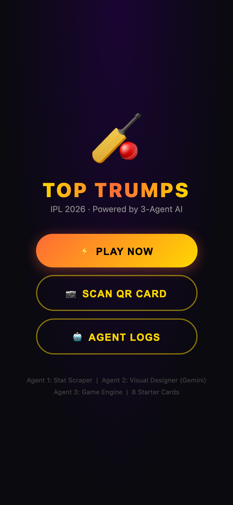
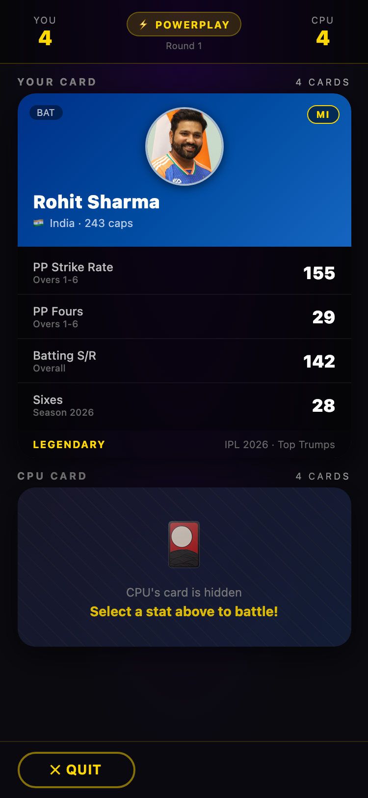
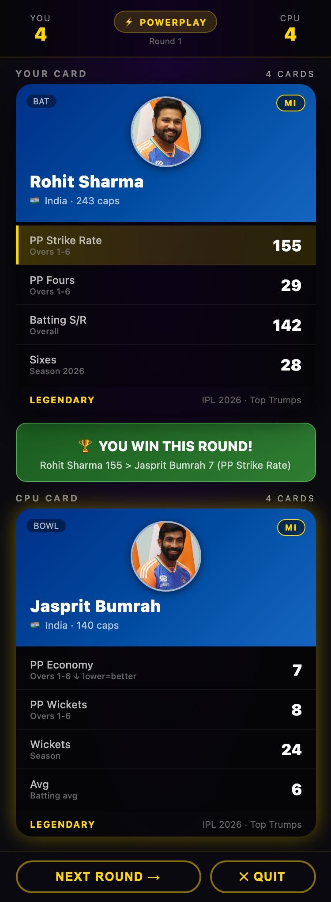

# 🏏 IPL Top Trumps 2026

Created with my team @ Google Developer Group's Agentic Premier League 2026, Visakhapatnam, Bharath

A mobile-first web game — a modern take on the classic **Top Trumps** card game, built around IPL 2026 players, real-world-style stats, and special **"Vizag Performance Bonuses."**

Built as a **3-agent workflow**, all running client-side in a single `index.html`:

| Agent | Role |
|-------|------|
| **Agent 1 — Stat Scraper** | Curates the player stat database, applies the Vizag bonus, and exposes card data. |
| **Agent 2 — Visual Designer** *(Gemini-style)* | Generates the card UI — team themes, rarity glows, stat bars, player photos. |
| **Agent 3 — Game Engine** | Runs the 1v1 Top Trumps logic, mode rules, CPU AI, and win/loss state machine. |

## 📸 Demo

<p align="center">
  
  &nbsp;&nbsp;
  
</p>

<p align="center">
  
  <br>
  <sub><b>Pick a stat → both cards flip → win logic + the Vizag bonus decide the round 🏆</b></sub>
</p>

## ✨ Features

- **8 starter cards** + QR-unlockable bonus cards (Suryakumar Yadav, Rashid Khan)
- **Two battle modes:**
  - 🌩️ **Powerplay** — overs 1–6 stats (PP strike rate, boundaries, openers shine)
  - 💀 **Death Overs** — overs 17–20 stats (finishers & death bowlers rule)
- **🏟️ Vizag Performance Bonus** — a flat **+20** to scoring stats for players who have won at Vizag (the SRH squad)
- **📷 QR scanning** — unlock hidden cards by camera or tap-to-simulate
- **⭐ Win star burst** — a celebratory particle burst every time you win a round (and the match)
- **🤖 Agent Logs** screen showing live activity from all three agents
- Real player photos with a graceful emoji fallback
- Team-themed cards (RCB, MI, CSK, SRH, DC, KKR, GT, LSG) and a Legendary/Epic/Rare rarity system

## ▶️ Run it locally

It's a single static file — serve the folder with any static server:

```bash
python3 -m http.server 7890
```

Then open <http://localhost:7890> on your phone or browser (mobile viewport recommended).

## 🛠️ Tech

- Vanilla HTML/CSS/JS — no build step, no framework
- [`html5-qrcode`](https://github.com/mebjas/html5-qrcode) for QR scanning
- CSS transforms for the 3D card flip and star-burst particles

## 🖼️ Image credits

- Most player photos: [Wikimedia Commons](https://commons.wikimedia.org) (CC-BY-SA)
- Abhishek Sharma & Heinrich Klaasen: Sunrisers Hyderabad promotional photos

---

*Stats are illustrative/for-entertainment and not official IPL data.*
